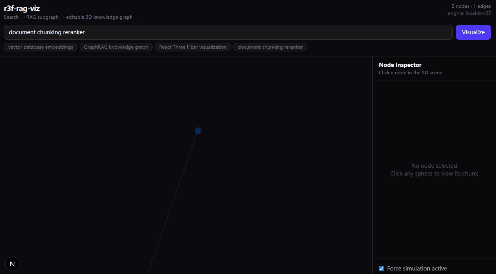

# r3f-rag-viz

**Editable 3D visualization layer for RAG & knowledge graphs** — built with React Three Fiber.

Map vector retrieval results to an interactive 3D scene: drag nodes, inspect chunks, emit edit events back to your app.

## Demo



1. Type a query (or pick a suggestion) and click **Visualize**
2. Retrieval hits become a **3D subgraph** — node size/color reflect relevance scores
3. **Left-drag** nodes · **right-drag** rotate · **scroll** zoom · click a node to read its chunk in the inspector

## Monorepo structure

```
r3f-rag-viz/
├── packages/
│   ├── core/          @r3f-rag-viz/core   — types, layouts, graph builders
│   └── react/         @r3f-rag-viz/react — <RAGScene>, hooks
└── apps/
    └── demo/          Next.js demo with local RAG search
```

## Quick Start

```bash
npm install
npm run dev
```

Open [http://localhost:3000](http://localhost:3000) — search the sample knowledge base and visualize results in 3D.

## Deploy to Vercel

This is a **monorepo**; the Next.js app lives in `apps/demo`.

1. Import the repo on [Vercel](https://vercel.com/new)
2. Set **Root Directory** → `apps/demo`
3. Framework Preset → **Next.js** (auto-detected)
4. **Do not** set Output Directory to `public` — leave empty or use defaults
5. Deploy

`apps/demo/vercel.json` installs workspace deps from the repo root and builds packages first.

If Root Directory is the repo root instead, use the root `vercel.json` and set Framework to **Next.js**.

## Usage

```tsx
import { RAGScene, useSelectedNode } from "@r3f-rag-viz/react";
import type { RAGGraph } from "@r3f-rag-viz/core";

const graph: RAGGraph = {
  nodes: [
    { id: "1", label: "Embeddings", content: "...", score: 0.94 },
    { id: "2", label: "Vector DB", content: "...", score: 0.91 },
  ],
  edges: [{ id: "e1", source: "1", target: "2", weight: 0.8 }],
};

<RAGScene
  graph={graph}
  onSceneChange={(event) => {
    // node-move | node-select
    console.log(event);
  }}
/>;
```

### Build subgraph from retrieval hits

```tsx
import { buildGraphFromRetrieval } from "@r3f-rag-viz/core";

const graph = buildGraphFromRetrieval(
  searchResults, // RetrievalChunk[]
  sourceEdges    // optional: filter to induced subgraph
);
```

### Hooks

```tsx
import { useRAGNodes, useSelectedNode, useSceneEditor } from "@r3f-rag-viz/react";
```

## Demo: RAG search

**Default (no API key):** BM25-style local search over a sample corpus.

**Optional:** set `OPENAI_API_KEY` in `apps/demo/.env.local` (see `.env.example`) to use OpenAI embeddings — auto-fallback to local on failure.

```bash
POST /api/search
{ "query": "vector embeddings", "topK": 6, "engine": "auto" }
```

Returns `{ graph, meta: { engine, resultCount } }`.

## Scripts

| Command | Description |
|---------|-------------|
| `npm run dev` | Start demo (transpiles packages from source) |
| `npm run build` | Build all workspaces |
| `npm run build:packages` | Build core + react only |
| `npm test` | Run core unit tests |

## Publish to npm

```bash
npm run build:packages
npm publish -w @r3f-rag-viz/core
npm publish -w @r3f-rag-viz/react
```

Before publishing, update `exports` in each package to point to `./dist/*` (or use the built `dist` tarballs from `files` field).

## Data contract

See [packages/core/src/types.ts](packages/core/src/types.ts) for `RAGNode`, `RAGEdge`, `RAGGraph`, `SceneChangeEvent`.

## Roadmap

- [x] Monorepo (`@r3f-rag-viz/core`, `@r3f-rag-viz/react`)
- [x] Demo with search → 3D visualization
- [x] GitHub Actions CI + core tests
- [x] README demo GIF
- [ ] npm publish
- [ ] Semantic / UMAP layout (Web Worker)
- [ ] Adapters (LangChain, Neo4j GraphRAG)
- [ ] NL scene editing (`@r3f-rag-viz/agent`)
- [ ] LOD + instanced rendering (500+ nodes)

## Tech stack

React · Next.js · React Three Fiber · d3-force-3d · Zustand · TanStack Query · Tailwind CSS

## License

MIT
